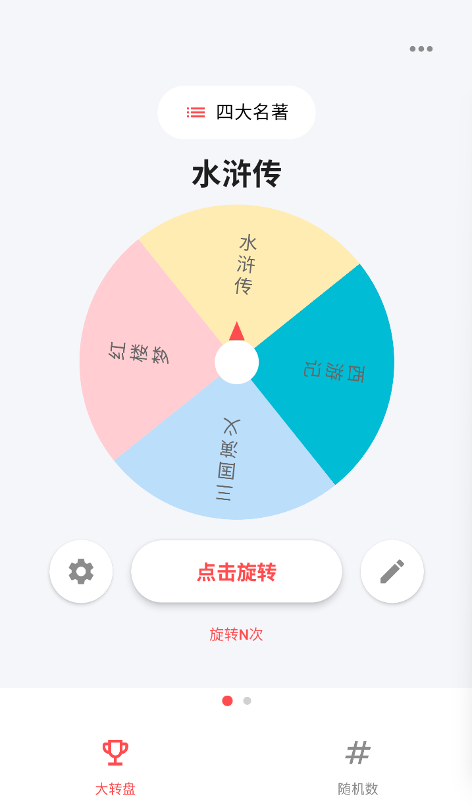
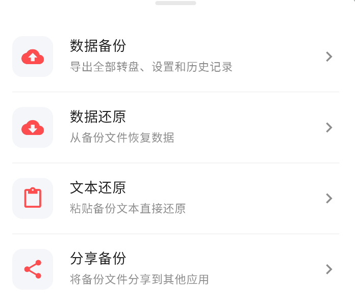
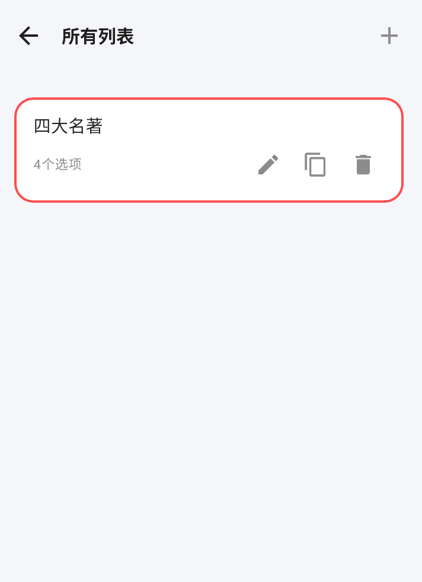
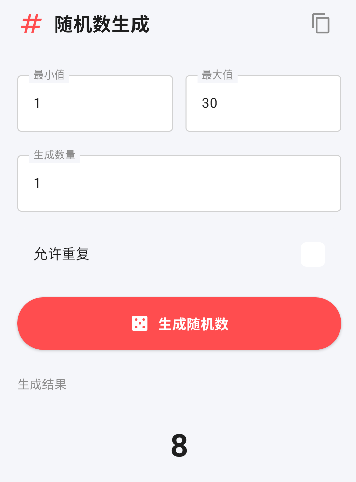
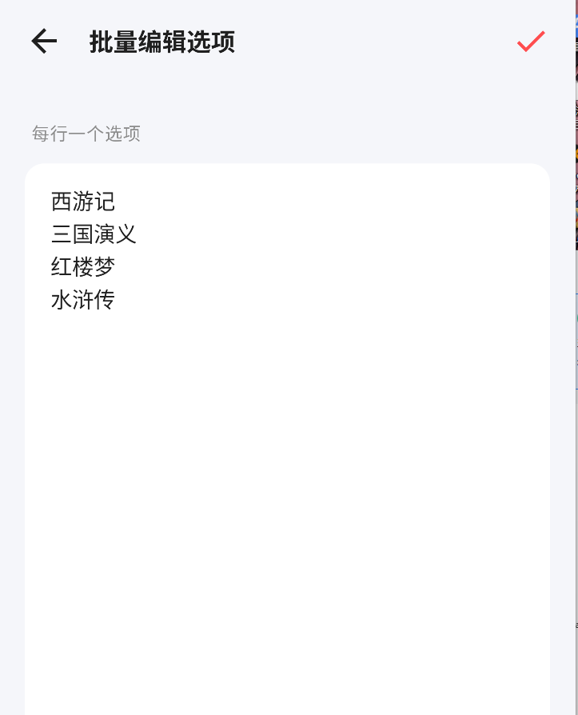
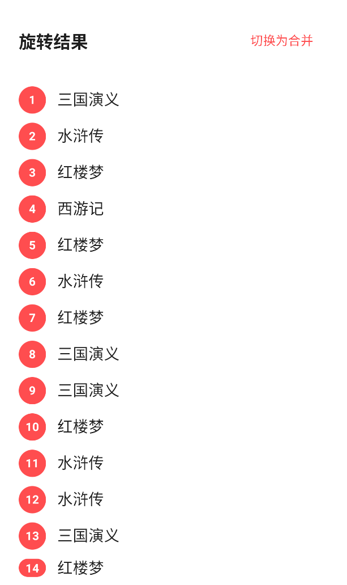
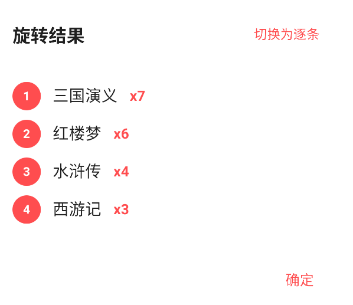

# 选择 · 转盘决策助手

一款基于 AI 辅助开发的 Android 转盘决策应用，帮助你快速解决"吃什么""谁来做"等纠结场景。

制作本软件的主要原因为，其他同类型软件都有广告，用着有些不舒服，所有花了点时间用ai做了个。

## 功能特点

- **转盘抽取**：流畅旋转动画，12 点钟指针判定结果
- **多转盘管理**：创建、切换、编辑多个独立转盘
- **选项权重**：设置权重影响中奖概率
- **个性化设置**：配色方案、字体大小、旋转时长可调
- **历史记录**：完整记录每次抽取结果
- **备份还原**：数据导出导入，本地持久化保护隐私

## 技术栈

- Kotlin + Jetpack Compose
- MVVM + Navigation Compose
- Jetpack DataStore 持久化
- GitHub Actions 自动构建发布

## 安装

1. 前往 [Releases](https://github.com/XingYuyuop/choose/releases) 下载最新 APK
2. 在手机上允许"安装未知来源应用"
3. 点击安装即可使用

## 说明

本项目由 AI 辅助完成代码编写，包含转盘核心逻辑、UI 界面设计、自动化构建流程等全部开发工作。

## 截图

页面：

同步：

列表：

随机：

批量：

显示：

合并：

## 许可证

MIT License
